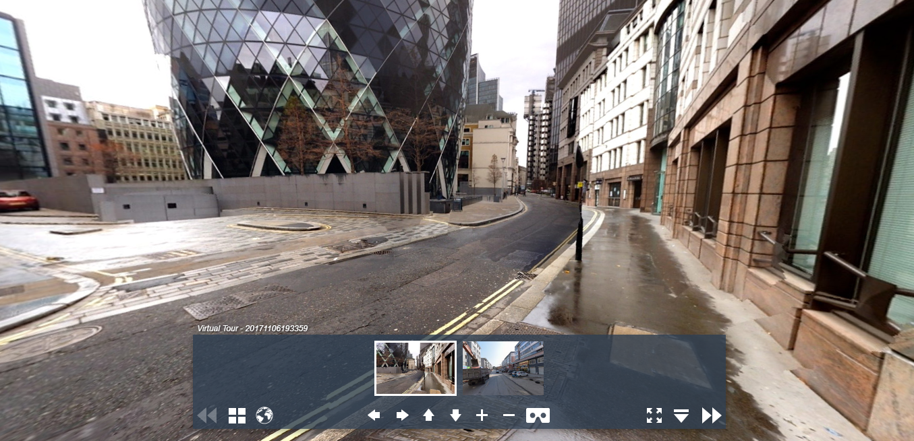

### vtour全景漫游及vtour文件夹介绍
使用MAKE VTOUR (MULTIRES) droplet工具生成全景漫游
<!--more-->
### 背景
在初始学习krpano时，可以借助krpano的工具生成全景漫游文件，之后可以根据需要修改tour.xml,定制skin等；
上节简单介绍了krpano使用Make pano的工具创建单场景应用，但大多数应用中场景数量不只一个，彼此之间可以跳转，这就需要借助MAKE VTOUR droplet工具了。而具体选择三种中的哪一种，根据应用场景需要选择，multires支持将全景切片分级，能够达到更好的展示效果，但会使全景文件大小增加，normal生成普通的pano_f.jpg,pano_b.jpg,pano_l.jpg，pano_r.jpg，pano_u.jpg，pano_d.jpg,preview.jpg，分别为全景图的前后左右上下，以及菜单中的预览图。
### 生成vtour
使用MAKE VTOUR (MULTIRES) droplet工具生成的全景漫游场景，场景彼此之间相互连接，能够从一个场景跳转到另一个场景。
可以同时选择多张全景图片拖放在该工具上，输入全景图类型，和全景角度，执行切片，等待完成。显示__done__之后，在全景图文件夹中生成vtour文件夹。
### vtour文件夹内容介绍
1. tour.html文件--嵌入全景的网页
2. tour.swf文件--krpano的flash viewer
3. tour.js文件--基于swfkrpano.js的一个viewer，即HTML5的viewer及嵌入HTML的js文件的合体
4. tour.xml文件--是krpano xml配置文件，定义全景图配置及皮肤配置
5. panos文件夹--存放处理后的全景图切片
6. plugins文件夹--主要存放使用到的插件

### 预览效果

### 补充
之后的主要工作为：定制skin，定制plugins，定制xml，一些动态操作全景图配置使编辑js文件，能够实现动态配置全景图程序，能够更好的融入到Web应用程序中，作为其中一个子功能模块。后续结合实际案例介绍具体实现方式。