QGIS 资料收集总结

<!--more-->


# 1.qgis自定义符号库

转载:https://blog.csdn.net/wywywywywywy123456/article/details/66971218

地图符号作为地图语言；抽象描述的客观世界并用直观、生动视觉的手段向我们传递地理信息。每款GIS软件都会自带一些常见的地图符号，也可以自定义地图符号。一般做专题地图那些常规符号库就不能满足我们。

在使用qgis时候发现自带地图符号少的可怜而且又不美观。于是我引进第三方地图符号；由于qgis自定义允许svg格式我去mapbox官网下载一套svg格式。svg网上资源还是蛮丰富的；加载qgis里只要设置一下路径可以。

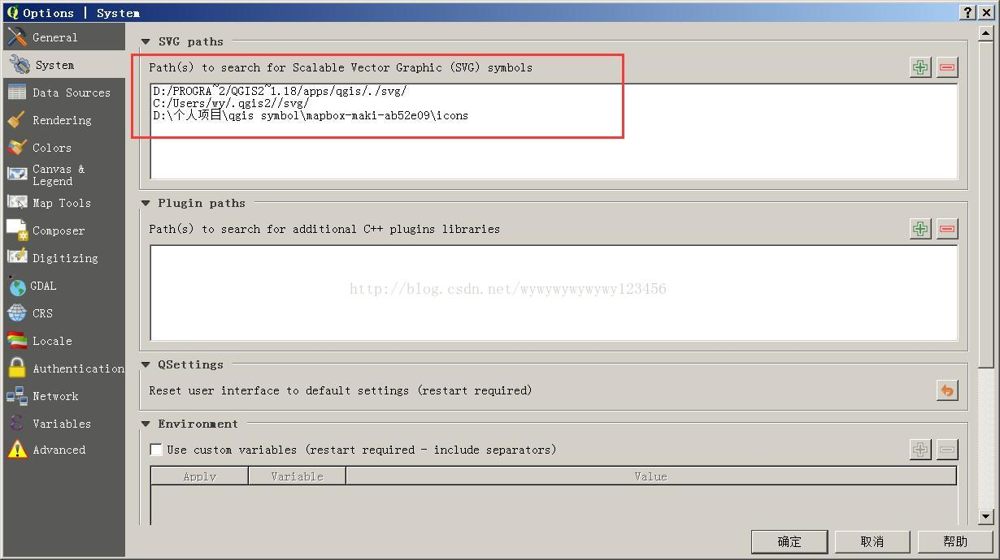

右击Properties选择样式类型SVG。

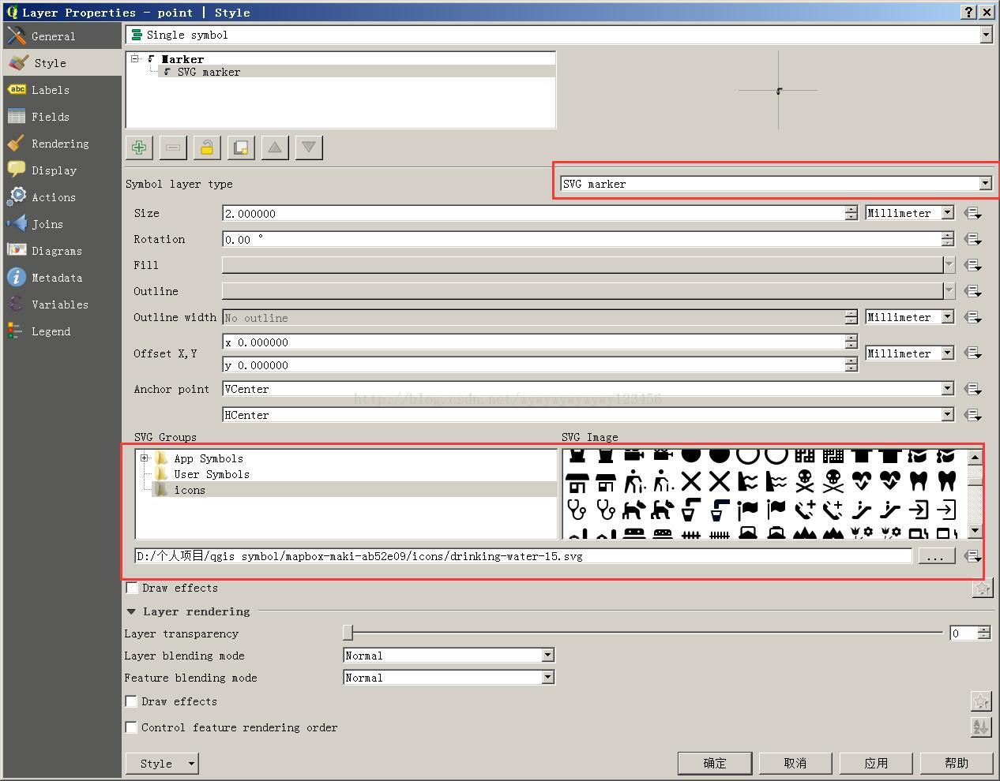

当然可以通过lnkscape软件来做符号，然后在保存SVG格式。

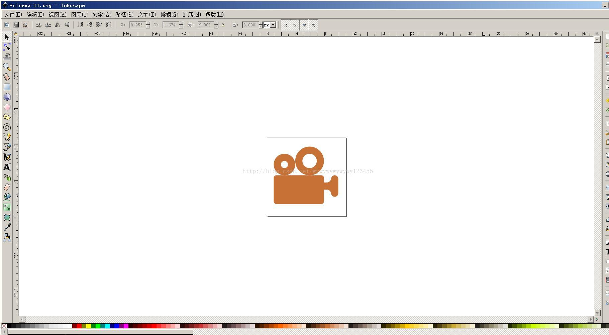

也可以写XML文件来添加地图符号。
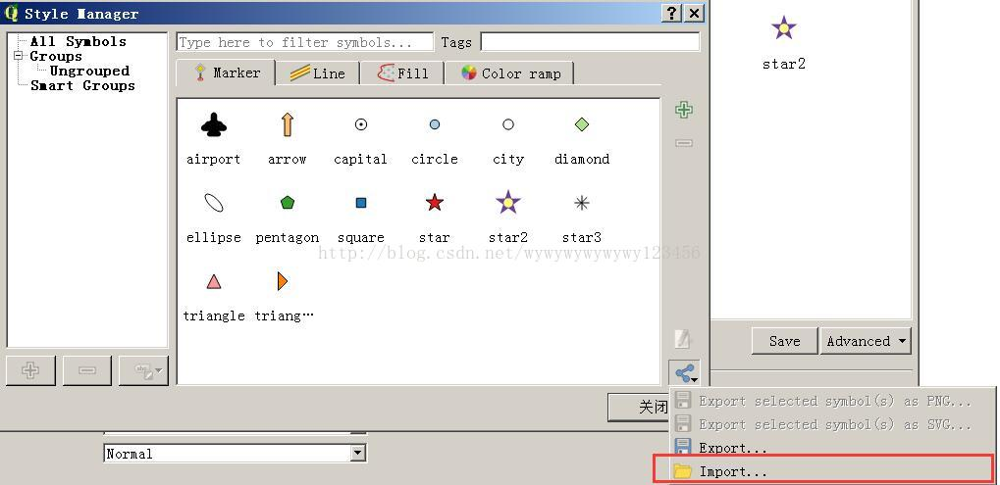

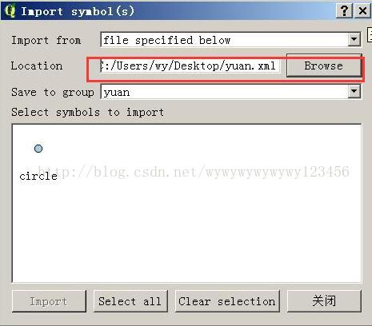


参考资料

http://docs.qgis.org/2.14/en/docs/training_manual/basic_map/symbology.html

https://www.mapbox.com/maki-icons/
https://thenounproject.com/

https://mapicons.mapsmarker.com/

# 2.QGIS切换在线地图服务的地图样式

转载：https://blog.csdn.net/weixin_29002209/article/details/112558162


底图是栅格瓦片服务，所以我们不能对其内容进行控制，更不能对其标注进行修改。不过这一切，在最新的QGIS中，借助一个插件，就可以实现底图效果的自定义了，不仅可以修改不同图层的样式，还可以直接将不想要的图层、标注直接关掉。

**插件MapTiler**


默认提供了7种地图样式，你可以在这些基础上进行改造。我使用最多的是Basic、Streets和Toner。


需要你输入一个Key才行。点击面板中的地址自己申请一个就可以啦。

申请完毕填上后，数据就可以加载到工程中啦。


此时，我们在图层树上选择所加载的图层，右侧就会出现其对应的设置面板。新添加的底图服务面板中，都是每一个可以设置的图层，可以对其进行开关勾选，更可以对其进行样式设置。然，不仅可以对图层效果进行设置，对图层标注也是可以修改的。

# 3.QGIS自定义符号

[QGIS开发之自定义符号](https://www.cnblogs.com/freeza/p/7799227.html)

在程序里添加了编辑矢量图层符号的功能，右键LayerTree的矢量图层，选择“Edit Symbol”，便可以选择或编辑图层的渲染符号。

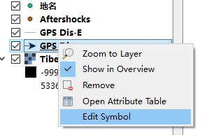

实现方法很简单，首先参照http://blog.csdn.net/deirjie/article/details/50428179，实现自定义的右键菜单类，具体代码可参考源码中的**QgsAppLayerTreeViewMenuProvider**类。源码里有一个**editVectorSymbol()**方法，原封不动地copy到自己的代码里就行了。

[](javascript:void(0);)

```
 1 void QgsAppLayerTreeViewMenuProvider::editVectorSymbol()
 2 {
 3   QAction* action = qobject_cast< QAction*>( sender() );
 4   if ( !action )
 5     return;
 6 
 7   QString layerId = action->property( "layerId" ).toString();
 8   QgsVectorLayer* layer = dynamic_cast<QgsVectorLayer*>( QgsMapLayerRegistry::instance()->mapLayer( layerId ) );
 9   if ( !layer )
10     return;
11 
12   QgsSingleSymbolRendererV2* singleRenderer = dynamic_cast< QgsSingleSymbolRendererV2* >( layer->rendererV2() );
13   if ( !singleRenderer )
14     return;
15 
16   QScopedPointer< QgsSymbolV2 > symbol( singleRenderer->symbol() ? singleRenderer->symbol()->clone() : nullptr );
17   QgsSymbolV2SelectorDialog dlg( symbol.data(), QgsStyleV2::defaultStyle(), layer, mView->window() );
18   dlg.setMapCanvas( mCanvas );
19   if ( dlg.exec() )
20   {
21     singleRenderer->setSymbol( symbol.take() );
22     layer->triggerRepaint();
23     mView->refreshLayerSymbology( layer->id() );
24   }
25 }
```

[](javascript:void(0);)

以下为点状的Symbol Selector实现效果：

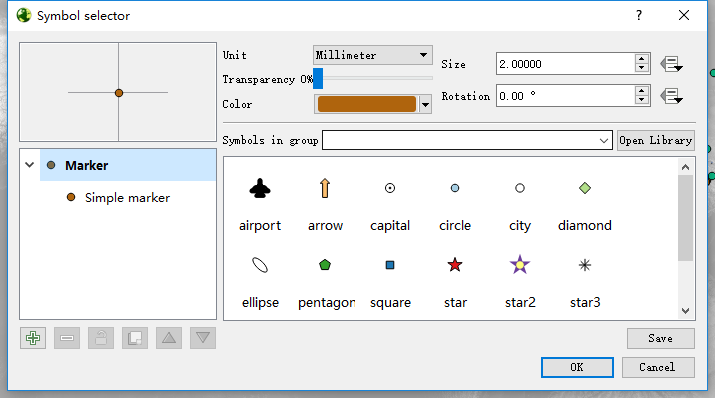

 

由于QGIS线状符号库里没有箭头符号，中午时使用QGIS桌面版自定义了一个带箭头的线状符号。线型为Marker Line，Marker placement为“on last vertex only”；Marker的类型为SVG marker，使用的箭头svg图标路径是开发包路径下的/svg/arrows/Arrow_05.svg；在设置一下点和线的尺寸、偏移、角度等参数便可以得到了。

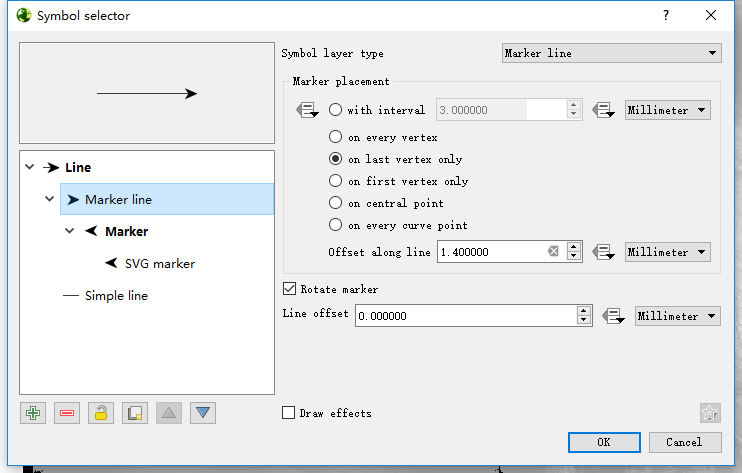

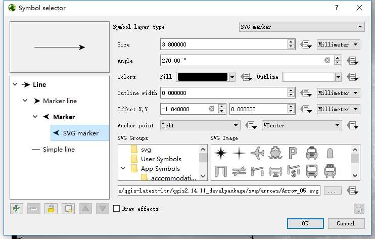

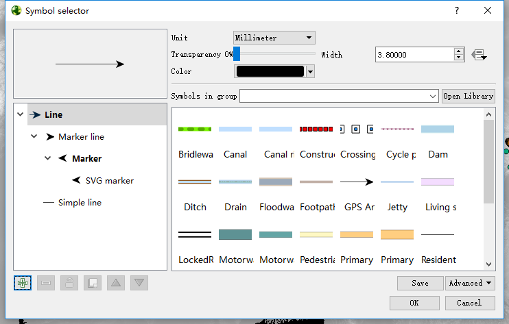

 

跟ArcGIS中的箭头符号对比一下：

 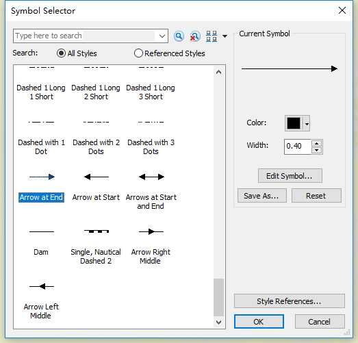

出乎我意料的是，在运行自己的代码时，发现程序的Symbol Selector跟桌面版的一样，也多了这个新定义的“GPS Arrow”符号。也就是说，这个符号设置应该是配置到了一个QGIS的类似环境变量的地方，经过一番探索发现，用户文件夹下有一个.qgis2的文件夹（我的是C:\Users\FangZhe\.qgis2）里面存放的应该是QGIS的配置数据。文件夹下有一个**symbology-ng-style.db**二进制文件。测试了一下，将此文件移走，再次打开符号编辑对话框，里面的符号样式就只剩默认符号了，此时.qgis2文件夹下又生成了一个新的**symbology-ng-style.db**文件。由此看来，此文件确实就是QGIS的符号库文件。日后发布程序时，应该只需要设置将此文件预先添加到配置文件夹之中就可以了，如此便可以省去用代码自定义符号的工作。

C:\Users\Administrator\AppData\Roaming\QGIS\QGIS3\profiles\default

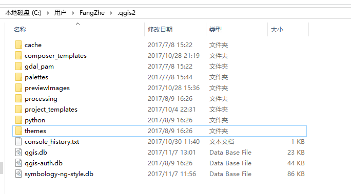

现在对.qgis2文件夹还是不甚了解，不过暂时不想多花力气研究它，日后用到时再说吧。

感谢博主Jacory_Gao的博客，对我的开发工作帮助巨大。关于如何使用代码自定义符号样式，可参考这篇文章：http://blog.csdn.net/deirjie/article/details/50464768


# 使用第三方SVG符号库导入QGIS

1、下载地址：

mapbox官网github

mapbox\mapbox-gl-styles-master\mapbox-gl-styles-master\sprites

maki:https://labs.mapbox.com/maki-icons/

一种方法是将下载的SVG文件夹路径在以下位置添加其路径：

```
Settings->Options->System->SVG Path
```

这样，您在QGIS样式器中将SVG符号作为组找到（“图层属性”->“样式...”。）

第二种方式：将符号复制到默认文件夹下，通常路径为：

C:\Users\Administrator\AppData\Roaming\QGIS\QGIS3\profiles\default

第三种、使用qgis中共享的SVG

安装插件Resource Sharing ，搜索maki,可以下载mapbox 的maki符号库

# 一款插件SLYR ESRI到QGIS兼容插件

https://north-road.com/slyr/

- 支持将MXD，MXT和PMF文档自动转换为QGIS项目，包括：
  - 支持转换**矢量和栅格图层**，与原始ArcMap外观非常精确地匹配
  - 支持转换层联接和关系
  - 页面布局转换为QGIS打印布局，完全支持使用多个数据框的多地图页面布局
  - 将数据驱动页面转换为QGIS打印图集
  - MXD文档元数据
- 将ESRI **LYR**文件转换为等效的QGIS（包括符号系统！）
- 读取和转换ESRI **.style**数据库
- 在QGIS中**无缝**，集成地处理MXD，LYR和其他ArcMap文档（例如，通过QGIS浏览器面板以及通过拖放操作）
- 一套**功能强大的**处理算法，可将ArcMap文档批量转换为QGIS格式
- 支持**将**图层直接从ArcMap或ArcCatalog**拖放**到QGIS窗口，并遵守所有图层样式。
- 支持**将**ArcMap页面布局元素直接**复制和粘贴**到QGIS打印布局中
- 支持AVL样式转换
- 对ArcMap .dat书签文件的集成支持
- 支持将ArcScene SXD文档转换为二维QGIS地图

SLYR可以将多种ESRI符号类型转换为等效的QGIS符号体系：

- 标记符号：简单标记，箭头标记，字符标记，图片标记，3d标记符号
- 线符号：简单线，制图线，标记线，哈希线和简单3d线
- 填充符号：简单填充，线条填充，标记填充，随机标记填充，图片填充和渐变填充